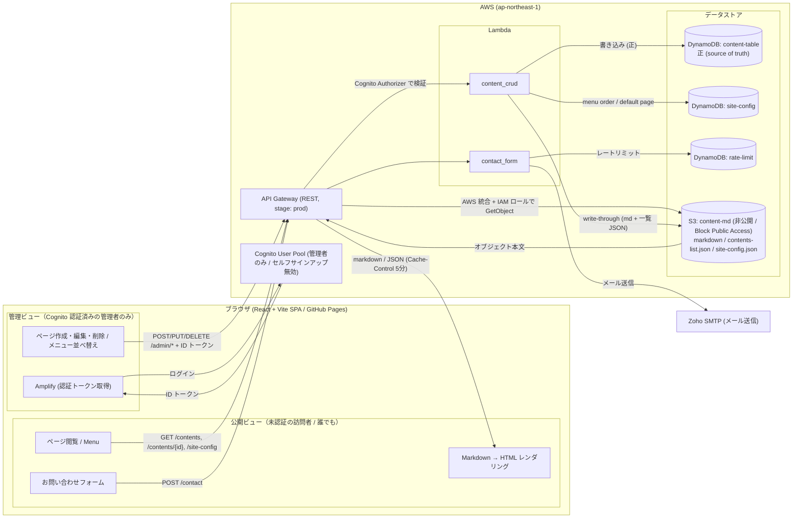

# FarEdge Labs

## 📁 Project Structure

```
src/
├── api/            # API呼び出し関数（fetch ラッパー）
├── auth/           # Authentication context & routes
├── components/
│   ├── Content/    # Page creation, editing, display
│   ├── Menu/       # Navigation system
│   └── CyberCursor/  # Custom cursor effect
├── hooks/          # Custom hooks (useSiteSettings)
├── lib/amplify/    # AWS Amplify configuration (Cognito auth only)
└── types/          # TypeScript definitions
```

## 🏗 Architecture



### データフロー概要

> ブラウザ内は同一の React SPA だが、機能面では **公開ビュー（未認証の訪問者：閲覧・お問い合わせ）** と **管理ビュー（Cognito 認証済みの管理者：作成・編集・削除・メニュー並べ替え）** に分かれる。メニューからのアイテム追加・編集・削除など `/admin/*` を叩く操作はすべて Cognito のログインが前提で、API Gateway 側の Cognito Authorizer でトークンが検証される。

- **公開読み取り**: フロント → API Gateway → **S3 の AWS 統合**（Lambda を経由しない）。S3 バケットは非公開（Block Public Access 全ブロック）で、API Gateway が実行用 IAM ロールでサーバー側から `GetObject` し、その本文をクライアントへ返す。**署名付き URL も公開バケットも使わない**。生の markdown / JSON を返し、クライアント側で HTML にレンダリング。
- **管理者書き込み**: フロント（Cognito 認証）→ API Gateway `/admin/*` → `content_crud` Lambda → **DynamoDB（正）** に保存し、**S3 へ write-through**（`contents/{id}.md` と一覧 `contents-list.json`）。
- **お問い合わせ**: フロント → API Gateway `/contact` → `contact_form` Lambda → レートリミット確認後、Zoho SMTP でメール送信。
- **認証**: Cognito User Pool（管理者のみ、セルフサインアップ無効）。フロントは Amplify 経由でトークンを取得し `/admin/*` 呼び出しに付与。

> 補足: S3 は読み取り高速化のためのレイヤーで、コンテンツの正 (source of truth) は DynamoDB。Lambda が書き込み時に両者を同期している。
